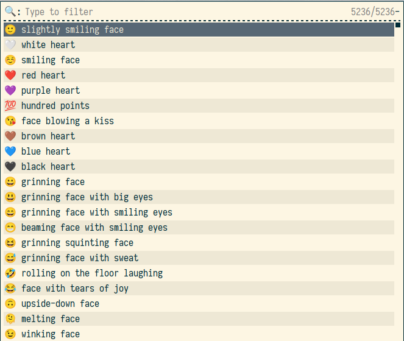
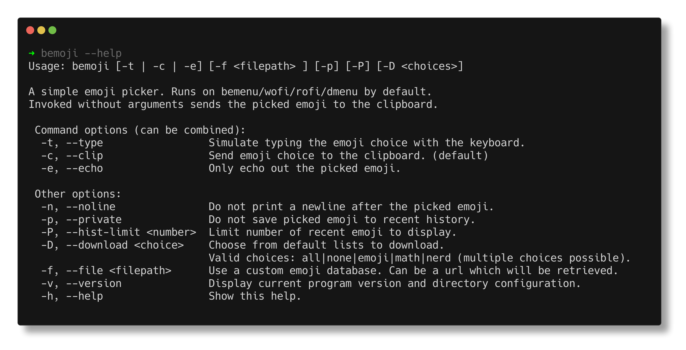

# bemoji ❤️ - Quickly ⛏️ your 🌟

[](https://ci.martyoeh.me/Marty/bemoji)


Emoji picker with support for bemenu/wofi/rofi/dmenu and wayland/X11.

Will remember your favorite emojis and give you quick access.

## 📁 Installation

### Dependencies

* One of `bemenu`, `wofi`, `rofi`, `dmenu`, or supplying your own picker.
* One of `wl-copy`, `xclip`, `xsel` or supplying your own clipboard tool.
* One of `wtype`, `xdotool` or supplying your own typing tool.
* `sed`, `grep`, `cut`, `sort`, `uniq`, `tr`, `curl` if using the download functionality.

To see how to substitute the default choices with your own tools,
see Options below.



### Manual

Option 1. Clone the repository and put the executable somewhere in your path:

```bash
git clone <INSERT-REPOSITORY>
chmod +x bemoji/bemoji
mv bemoji/bemoji /usr/local/bin/bemoji
rm -r bemoji
```

Option 2. Clone the repository and link the executable to your path:

```bash
git clone <INSERT-REPOSITORY>
chmod +x bemoji/bemoji
ln -s bemoji/bemoji /usr/local/bin/bemoji
```

### Arch Linux

On Arch Linux, bemoji has been packaged for the [AUR](https://aur.archlinux.org/packages?K=bemoji) so it can be installed manually from here or easily with your preferred AUR helper, e.g.:

```bash
paru -S bemoji # or bemoji-git
```

## 💿 Usage


Simply execute `bemoji` without any options to set up the default emoji database and let you quickly pick an emoji.
It will be copied to your clipboard for you to paste anywhere.
If you execute `bemoji -t` it will directly type your emoji directly into whatever application is in focus.

When the emoji list is open you can always press `Alt+1` to send the selected emoji to clipboard and `Alt+2` to type the selected emoji,
regardless of what the default action is set to.
(Currently works in bemenu and rofi.)

You can also map the picker to a key combination for quick access, e.g.

In `swaywm`, put the following in `~/.config/sway/config`:

```
bindsym Mod4+Shift+e exec bemoji -t
```

For `i3`, put the same into `~/.config/i3/config`:

```
bindsym Mod4+Shift+e exec bemoji -t
```

For `riverwm`, put the following in `~/.config/river/init`:

```
riverctl map normal Mod4+Shift E spawn "bemoji -t"
```

In `sxhkd`, put the following into `~/.config/sxhkd/sxhkdrc`:

```
super + Shift + e
    bemoji -t
```

And you can easily type any emoji with the help of `Super+Shift+E`.

## 🧰 Options



bemoji comes with a couple of options to specify actions, emoji libraries and directories being used.

### Adding your own emoji

Simply put your own emoji list into the bemoji data directory.
By default, the directory will be at your `$XDG_DATA_HOME/bemoji` location -
most likely this is `~/.local/share/bemoji`.

Add any number of `.txt` files containing additional emoji to this directory:

```
🫦 Biting lip
🫶 Heart Hands
```

The lists *need* to have the format `🙂 description of emoji` with a whitespace separating the emoji and its description.
The description can have as many words and whitespaces as you want.

### Ignoring the most recent emoji

By default, bemoji will sort the list it displays by your most frequently and most recently used emoji.
To disable this behavior, execute bemoji like the following:

```bash
bemoji -P 0
```

This will stop bemoji from adding recently used emoji before displaying the list.

You can also stop bemoji from adding any emoji to your history in the first place:

```bash
bemoji -p
```

This will not add any of the emoji you pick to your recent emojis.
Put both together to completely ignore the recent emoji feature of the program:

```bash
bemoji -p -P0
```

Like this, you'll be hiding any recent personal emoji and no one will know that you always type 👄🍆💦.

To limit the number of your recently used emoji that are shown without hiding them completely simply increase the number to however many you wish to display. 
For example, to display only the top 4 recently used emoji:

```bash
bemoji -P 4
```

The recent list will also contain emoji that are *not* usually on your lists,
so kept in single-use lists for example.
If you don't wish those to show up, make use of these options.

### Setting custom directories and editing history

By default bemoji stores your recent history in `$XDG_STATE_HOME/bemoji-history.txt`,
so most often in `~/.local/state/bemoji-history.txt`

You can edit this file in any text editor to change your recent history,
removing, adding or changing the emoji appearing there.

You can overwrite the directories bemoji uses for its emoji lists and history files with the following two environment variables:

```
BEMOJI_DB_LOCATION=/path/to/my/emoji/directory
BEMOJI_HISTORY_LOCATION=/path/to/my/state/directory
```

There are no equivalent commandline arguments to overwrite these two settings.

### Display one custom emoji list

A custom emoji list can be supplied as commandline argument `-f` or `BEMOJI_CUSTOM_LIST` environment variable.

```bash
bemoji -f path/to/my/list.txt
```

The list will override the normally presented emoji,
so that only the custom list and recent emoji will be displayed.
To display *only* the emoji list passed in, pass an extra `-P` flag to bemoji.

The path can also be a weblink which bemoji will download and use:

```bash
bemoji -f "https://raw.githubusercontent.com/jchook/emoji-menu/master/data/emojis.txt"
```

### Download additional emoji sets

bemoji automatically downloads an emoji list for you to use on first invocation.
By default, it only downloads emoji, though you can have it download math symbols and nerdfont icons as well.
To download additional sets, execute bemoji like the following:

```bash
bemoji -D all
```

This will download *all* default sets bemoji knows - which is currently the default emoji list, nerd font icons, and a long list of math symbols.
Other valid options for this setting are `emoji`, `math`, `nerd`, `none`.

```bash
bemoji -D "math emoji nerd"
```

The above command is equivalent to `all` as you can mention multiple sets you want downloaded.

If set to `none` and no files are in the emoji directory,
bemoji will complain and not show anything.

### Do not skip to new line after output

By default, bemoji will craft the final output using a typical `echo` call for anything it prints directly.

That means, it will also contain a final newline character.
So, for example it would technically output `🦊\n` for the `fox` emoji,
which skips to a new line in most circumstances.

If you wish to prevent this character in the final output, use:

```bash
bemoji -n
```

Using this option will suppress the newline character and *only* print `🦊` as its output.

### Using a custom tool for picking, clipping, typing

If you want to replace one of the default supported tools with your own you can do this through environment variables:

```bash
BEMOJI_PICKER_CMD="path/to/your/picker-tool"
BEMOJI_CLIP_CMD="path/to/your/clipboard/tool"
BEMOJI_TYPE_CMD="path/to/your/xdotool"
```

The candidate list (in the case of picker tool) or the picked selection are passed to the tools through stdin.

This is pretty experimental and you'll have to see how well it works for you.
The setting can not be changed through the commandline alone.

### Execute a custom command with my emoji

You can execute bemoji with the `-e` flag with which you tell it not to do anything but echo out the chosen emoji.

This can be very useful for creating your own little script with it:

```bash
bemoji -e | cat <(echo -n "https://emojipedia.org/") - | xargs xdg-open
```

This snippet will open a wiki page for the picked emoji in your browser.

Of course, there are many more possibilities.
This is just an example to show how the echo mode works.

### A list of all environment variables

What follows is a list of all environment variables bemoji understands,
with their default settings

```bash
BEMOJI_DB_LOCATION="$XDG_DATA_HOME/bemoji" # where the emoji lists reside
BEMOJI_HISTORY_LOCATION="$XDG_STATE_HOME" # where the state file resides
BEMOJI_CUSTOM_LIST="" # the custom emoji list to display
BEMOJI_DOWNLOAD_LIST="" # the default emoji lists to download to database
BEMOJI_DEFAULT_COMMAND="" # which command to invoke by default
BEMOJI_PICKER_CMD="bemenu" # which picker tool to use
BEMOJI_CLIP_CMD="wl-copy" # which clipboard tool to use
BEMOJI_TYPE_CMD="wtype" # which typing tool to use (ydotool will NOT work)
BEMOJI_PRIVATE_MODE=false # whether to save new entries
BEMOJI_LIMIT_RECENT="" # whether to display recent entries
BEMOJI_ECHO_NEWLINE=true # whether to end the output with a newline character
```

## 🤗 Issues

Thanks for checking this program out! ❤

If there are any problems, don't hesitate to open an issue.

If you have an idea or improvement, don't hesitate to open a merge request!

### Running tests

This project makes use of [bash-bats](https://github.com/bats-core/bats-core) (community fork) to test some of its functionality.

To run the tests locally, simply execute `./test/bats/bin/bats test`.

I would suggest running the test suite in docker instead, just to minimize the possibility of something going awry and borking up your local file system.
To run the tests in a docker suite, execute `docker run --rm -it -v "$PWD:/code" bats/bats:latest /code/test`
